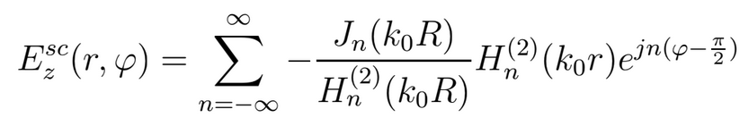

# Scattering of a Plane Electromagnetic Wave by a Conducting Cylinder

## Simulation in Matlab

The polarizations of the wave:

Superposition with the Bessel function:

The scattered component:

Calculate the whole field:

## Plots:

Pointing vector:

  

see other's solutions:
- https://www.math.nyu.edu/faculty/muraki/public/am2000/
- https://www.mathworks.com/matlabcentral/fileexchange/30162-cylinder-scattering
